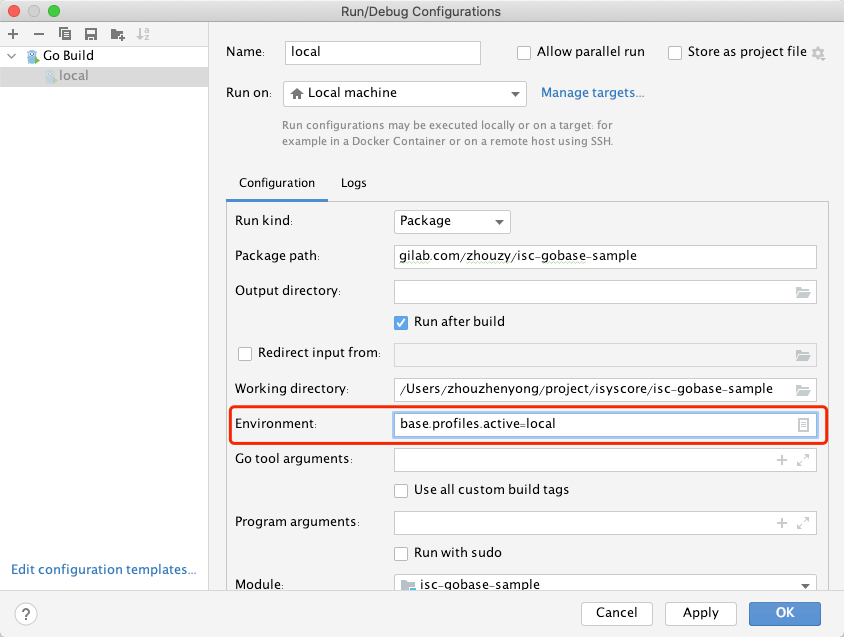

## config包
config包主要用于加载和管理项目中配置文件中的内容，配置文件为"application"开头的格式

### 1. 配置文件路径
默认该文件与main函数所在的类同目录
```go
// 示例
- application.yml
- application-local.yml
```

### 2. 配置文件格式
支持yaml、yml、json、properties配置文件
优先级: json > properties > yaml > yml

### 3. 支持profile加载不同配置文件
格式：application-{profile}.yyy
其中profile对应的变量为：base.profiles.active
变量的设置可以有如下
- 本地配置
- 环境变量配置

优先级：环境变量 > 本地配置



#### 代码中读取指定环境配置
```go
// 配置环境
os.Setenv("base.profiles.active", "local")

// 然后再加载的时候就会加载local的配置文件
config.LoadConfig()
```
或者：直接加载对应{profile}的文件
```go
// 配置环境
config.LoadFile("./application-local.yaml")
```
也支持叠加
```go
// 配置环境
config.LoadFile("./application-local.yaml")
config.AppendFile("./application-append.yaml")
```

### 4. 支持直接获取配置值
config包中提供了各种类型的api，方便实时获取
```go
// 基本类型
config.getValueInt("xxx.xxx")
config.getValueInt32("xxx.xxx")
config.getValueInt64("xxx.xxx")
config.getValueBool("xxx.xxx")
config.getValueString("xxx.xxx")
// ...

// 结构类型
config.getValueObject("xxx.xxx", &xxx)
```
示例：
```go
var ServerCfg ServerConfig

// base前缀
type BaseConfig struct {
    Application AppApplication
    Data string
}

type AppApplication struct {
    Name string
}
```

```yaml
base:
  application:
    name: "xxx-local"
  data: "test"
```

```go
// 直接读取即可
config.getValueObject("base", &ServerCfg)
```

说明：
v1.0.12版本后，支持对配置的中划线支持，此外还支持更多配置
- 中划线：比如：data-base-user
- 小驼峰：比如：dataBaseUser
- 大驼峰：比如：DataBaseUser
- 下划线：比如：data_base_user

比如：
```yaml
key1:
  ok1:
    hao-de-ok: 12
    name-age: 32
  ok2:
    haoDeOk: 12
    nameAge: 32
  ok3:
    HaoDeOk: 12
    NameAge: 32
  ok4:
    hao_de_ok: 12
    name_age: 32
```
```go
type SmallEntity struct {
    HaoDeOk int
    NameAge int
}

// 可以读取到
func TestSmall(t *testing.T) {
    config.LoadConfig()

    entity1 := SmallEntity{}
    config.GetValueObject("key1.ok1", &entity1)
    assert.Equal(t, entity1.NameAge, 32)
    assert.Equal(t, entity1.HaoDeOk, 12)

    entity2 := SmallEntity{}
    config.GetValueObject("key1.ok2", &entity2)
    assert.Equal(t, entity2.NameAge, 32)
    assert.Equal(t, entity2.HaoDeOk, 12)

    entity3 := SmallEntity{}
    config.GetValueObject("key1.ok3", &entity3)
    assert.Equal(t, entity3.NameAge, 32)
    assert.Equal(t, entity3.HaoDeOk, 12)

    entity4 := SmallEntity{}
    config.GetValueObject("key1.ok4", &entity4)
    assert.Equal(t, entity4.NameAge, 32)
    assert.Equal(t, entity4.HaoDeOk, 12)
}
```

### 6. 支持配置的叠加，相对路径和绝对路径
在配置已经加载完毕后，需要对一些配置进行覆盖，比如运维这边有相关的需求时候
```go
// 相对路径
config.AppendConfigFromRelativePath(xx)

// 绝对路径
config.AppendConfigFromAbsPath(xx)
```

### 7. 支持自动读取cm文件
应用启动会默认读取/home/{base.application.name}/config/application-default.yml对应的内容并覆盖应用的配置中

也支持环境变量配置 `base.config.cm.path=xxx`

示例：
```go
// 也可以代码中配置
os.Setenv("base.config.cm.path", "./application-append.yaml")
```

### 8. 支持配置的在线查看以及实时变更

如下配置开启后，就可以在线查看应用的所有配置了
```yaml
base:
  endpoint:
    # 配置的动态实时变更，默认关闭
    config:
      enable: true/false
```

```shell
// 查看应用所有配置
curl http://localhost:xxx/{api-prefix}/{api-module}/config/values

// 查看应用所有配置（yaml结构）
curl http://localhost:xxx/{api-prefix}/{api-module}/config/values/yaml

// 查看应用的某个配置
curl http://localhost:xxx/{api-prefix}/{api-module}/config/value/{key}

// 修改应用的配置
curl -X PUT http://localhost:xxx/{api-prefix}/{api-module}/config/update -d '{"key":"xxx", "value":"yyyy"}'
```

提示：<br/>
修改应用的配置会发送配置变更事件"event_of_config_change"，如果想要对配置变更进行监听，请监听，示例：
```go
func xxxx() {
    // 添加配置变更事件的监听，listener.EventOfConfigChange是内置的"event_of_config_change"
    listener.AddListener(listener.EventOfConfigChange, ConfigChangeListener)
}

func ConfigChangeListener(event listener.BaseEvent) {
    ev := event.(listener.ConfigChangeEvent)
    if ev.Key == "xxx" {
        value := ev.Value
        // 你的配置变更处理代码
    }
}
```

---

#### 注意

- 配置实体化
  - 无法动态的变更
  - 不支持默认配置
- api实时调用
  - 配置可以动态的变更
  - 有默认的api
    
建议：配置使用时候建议使用config.GetXXXX()

其中动态变更只对api实时调用的方式有效

---

### 9. 支持配置的占位符
version > 1.4.13
```yaml
place:
  name: "test"
  name2: "test2"

test:
  name: ${place.name}
  name2: ${place.name2}
```
格式支持：yml、yaml、json和properties
```json
{
  "place":{
    "name":"test",
    "name2":"test2"
  },
  "test":{
    "name":"${place.name}",
    "name2":"${place.name2}"
  }
}
```
```properties
place.name=test
place.name2=test2
test.name=${place.name}
test.name2=${place.name2}
```
#### 注意：
该版本暂时不支持非叶子节点数据，比如如下的就无法获取
```properties
place:
  name: "test"
  name2: "test2"

test:
  # 如下无法读取数据
  tt: ${place}
```
